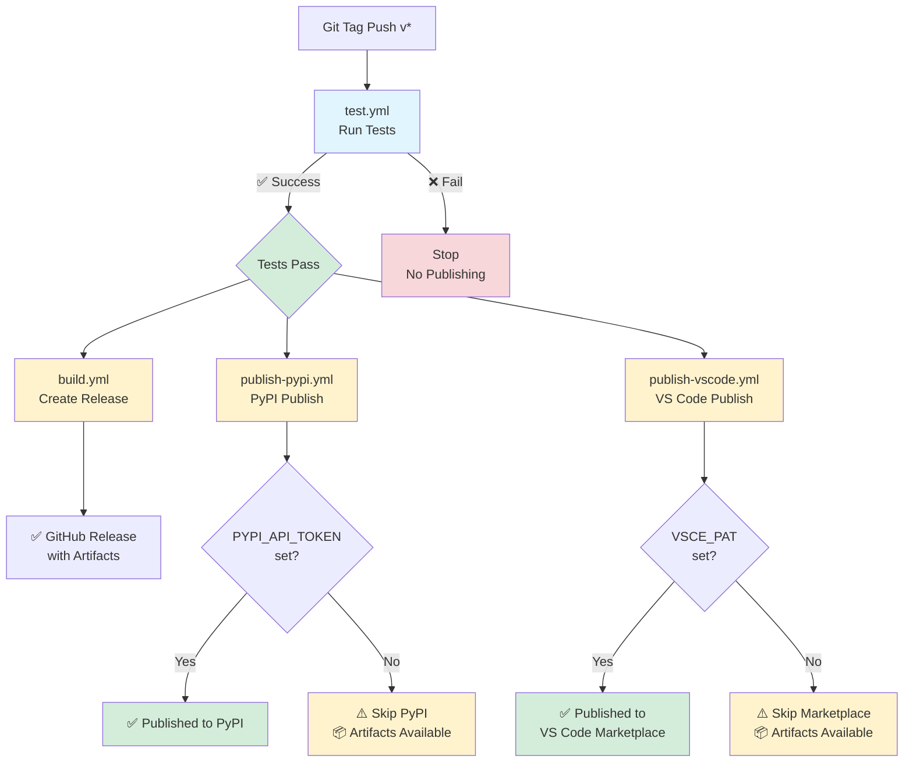
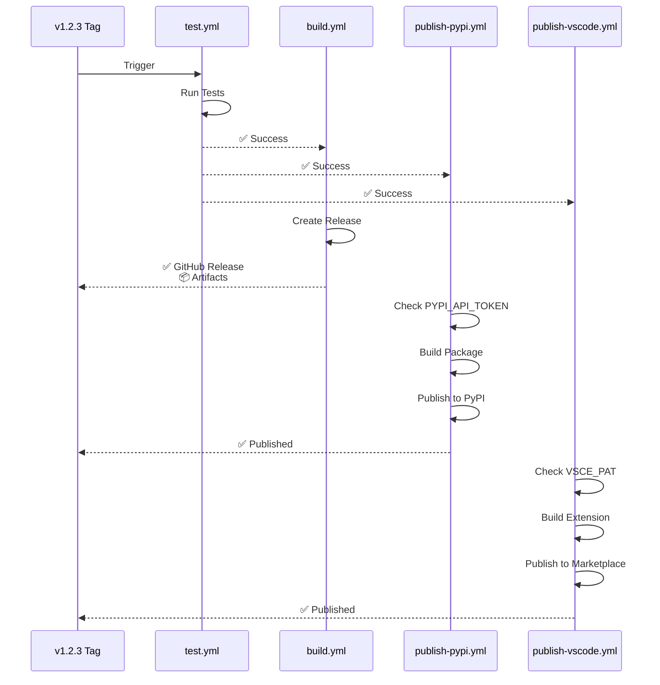
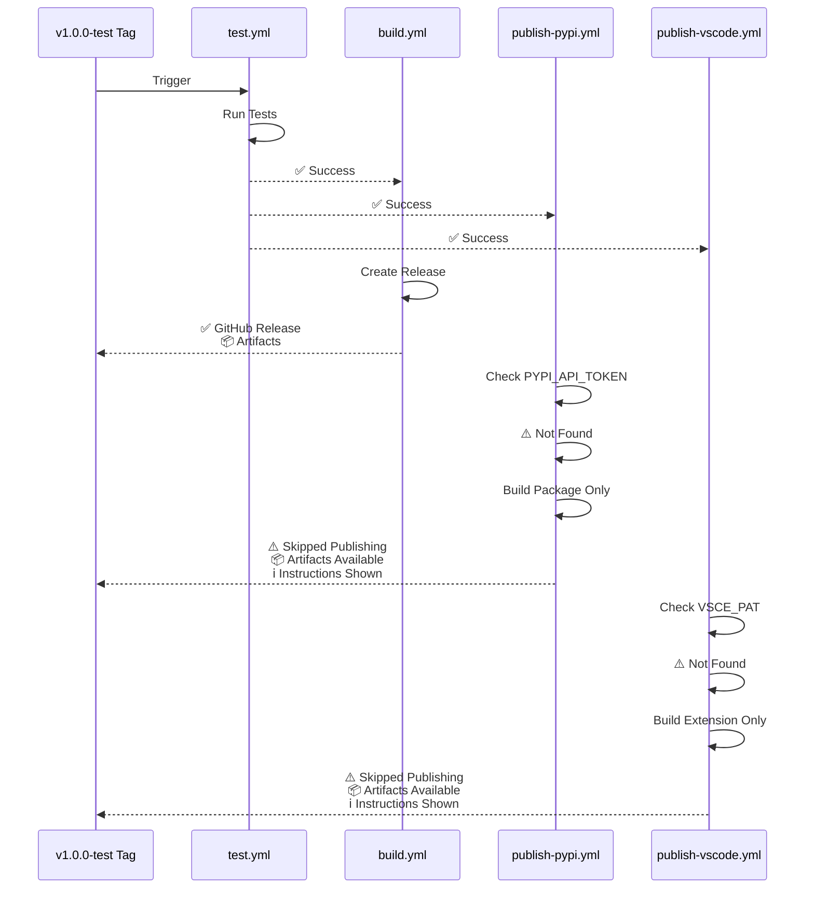
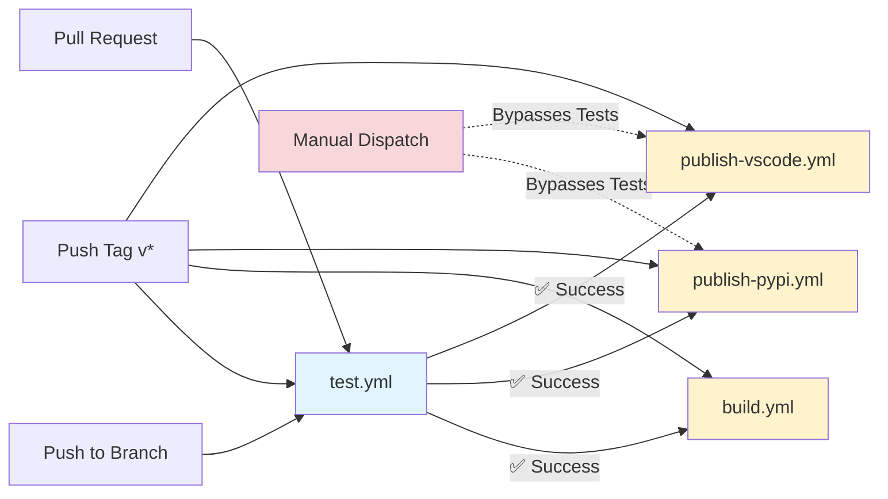
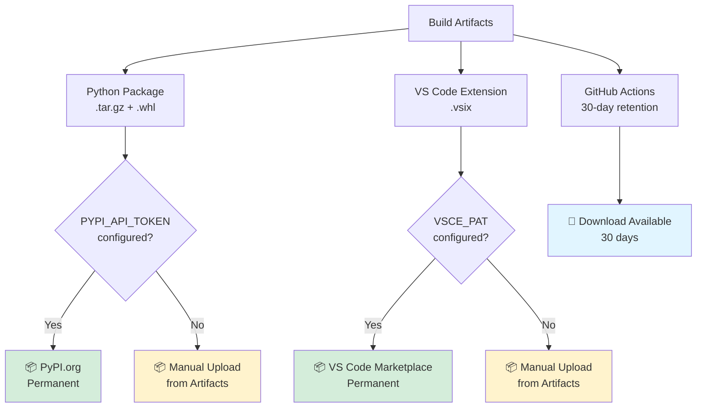
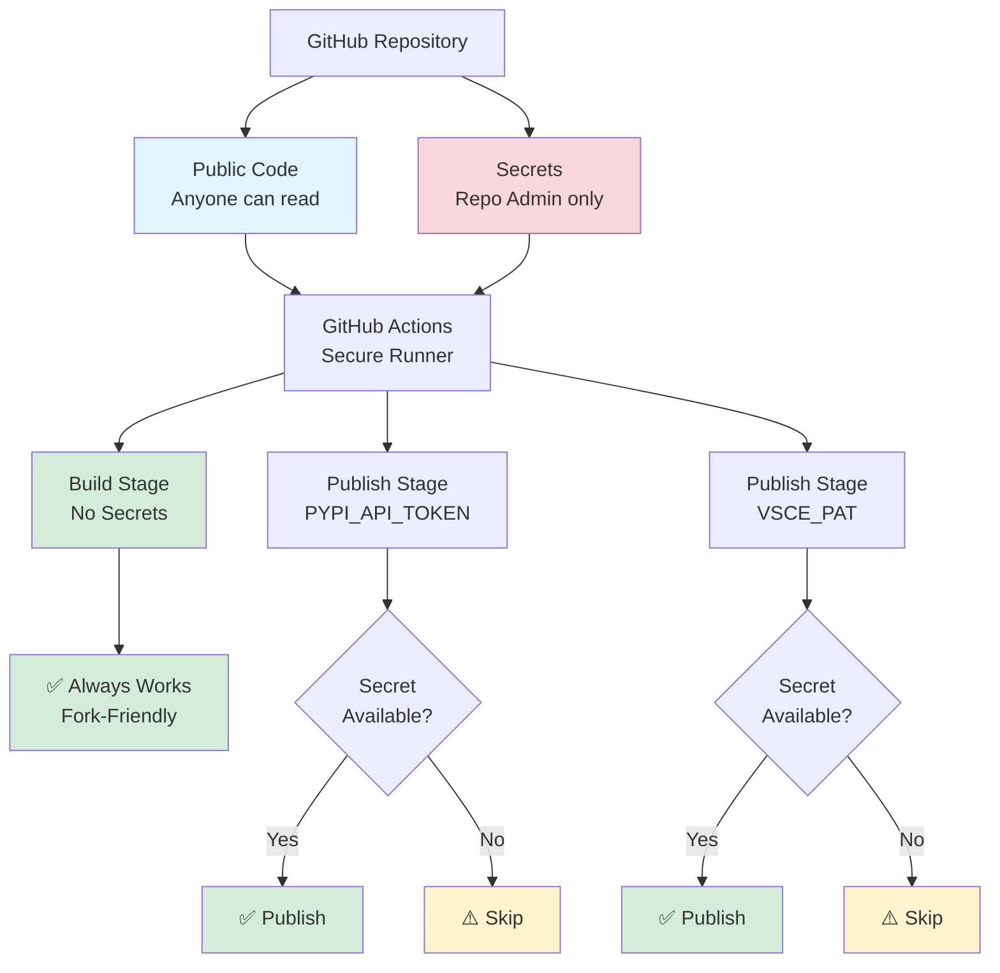
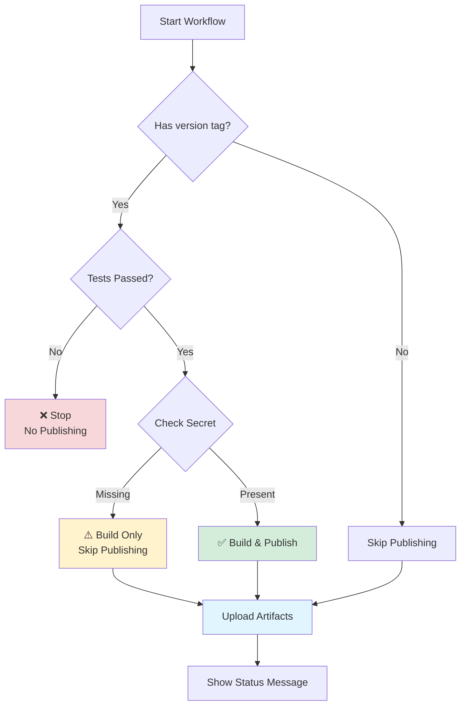
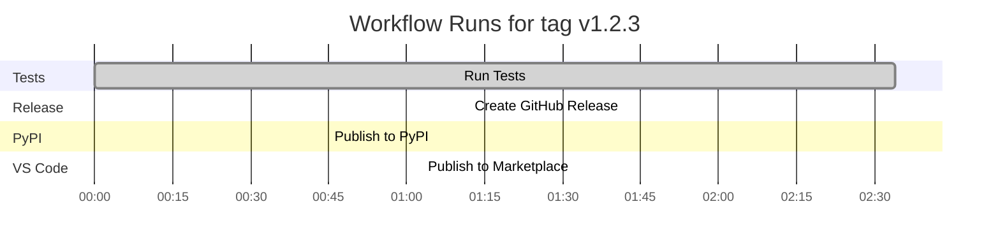
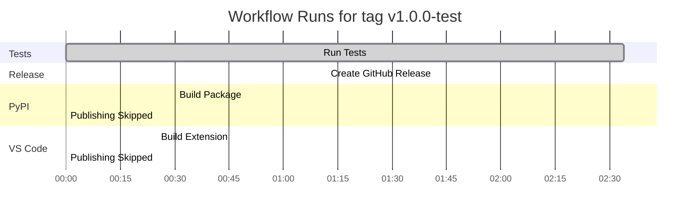

# Workflow Architecture

## Main Workflow Flow

## Workflow States

### With All Secrets Configured

### Without Secrets (Developer Mode)

## Secret Dependency Matrix

| Workflow | Secret Required | Behavior Without Secret | Depends on Tests |
|----------|----------------|------------------------|------------------|
| test.yml | None | ✅ Always runs | N/A (runs first) |
| build.yml | None | ✅ Always creates release | ✅ Yes |
| publish-pypi.yml | `PYPI_API_TOKEN` | ⚠️ Builds but skips PyPI upload | ✅ Yes |
| publish-vscode.yml | `VSCE_PAT` | ⚠️ Builds but skips marketplace publish | ✅ Yes |

## Workflow Triggers

**Trigger Summary:**

| Event | test.yml | build.yml | publish-pypi.yml | publish-vscode.yml |
|-------|----------|-----------|------------------|-------------------|
| Push to branch | ✅ | ❌ | ❌ | ❌ |
| Pull request | ✅ | ❌ | ❌ | ❌ |
| Push tag (v*) | ✅ | ⏳ Waits for tests | ⏳ Waits for tests | ⏳ Waits for tests |
| Manual dispatch | ❌ | ❌ | ⚠️ Bypasses tests | ⚠️ Bypasses tests |

## Artifact Flow

## Security Model

## Decision Flow for Publishing

## Monitoring Dashboard View

### Successful Run (All Secrets Configured)

**Results:**
- ✅ Tests passed (2m 34s)
- ✅ GitHub Release created (1m 12s)
- ✅ Published to PyPI (45s)
- ✅ Published to VS Code Marketplace (1m 03s)
- 📦 Artifacts available for download

### Run Without Secrets (Developer Mode)

**Results:**
- ✅ Tests passed (2m 34s)
- ✅ GitHub Release created (1m 12s)
- ⚠️ PyPI publishing skipped - PYPI_API_TOKEN not configured (30s build only)
- ⚠️ VS Code publishing skipped - VSCE_PAT not configured (25s build only)
- 📦 Artifacts available for manual upload
- ℹ️ Instructions shown for configuring secrets
